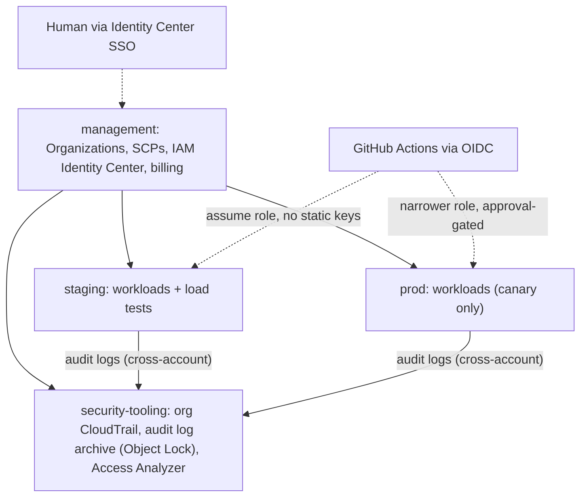
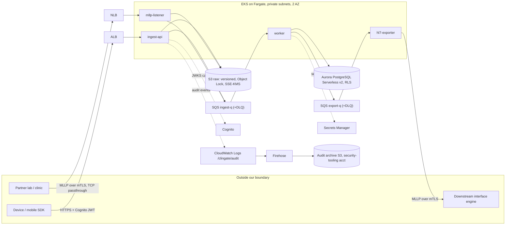
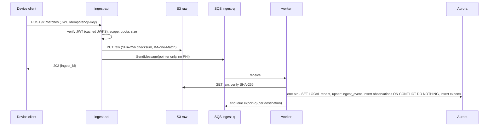
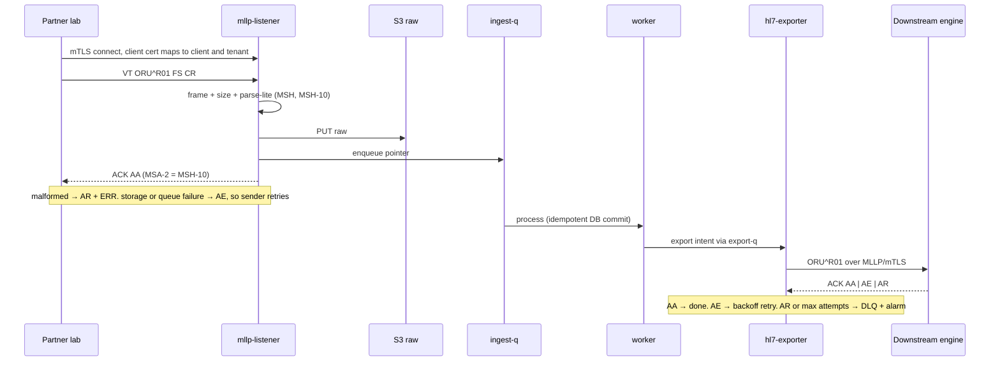

# ClinGate — Clinical Data Ingestion Gateway

**Platform specification · draft v0.1 · 2026-09**
Companion docs: [SECURITY.md](SECURITY.md) · [LOADTEST.md](LOADTEST.md)

---

## 1. Purpose and scope

### 1.1 What this is

ClinGate is a **lab platform** for practicing DevSecOps and scalability on regulated
health data. It ingests clinical observations from two kinds of sources, normalizes
them, stores them durably and auditably, and hands them off to downstream systems:

| Adapter | Source | Protocol | Why it exists |
|---|---|---|---|
| **A. Results adapter** | Partner labs / clinics | HL7 v2.5.1 `ORU^R01` over MLLP (mTLS) | Occupational-health exam results (SatMed-style scenario) |
| **B. Device adapter** | Wearables / mobile SDK | JSON over HTTPS (Cognito M2M) | Connected-device streams (ADI Health Solutions-style scenario) |

Both adapters feed **one core pipeline** (durable raw store → queue → worker →
relational store → export). The point of the lab is that the interesting failures in
health-data systems are unglamorous: silent loss, duplicates, PHI leaking into logs, a
serial protocol capping throughput, a burst arriving at the wrong moment.

### 1.2 Honesty statement

- This is a **lab and a design proposal**. It is not deployed for, and has not served,
  any real organization.
- **SatMed is used as a sizing reference** (real business volumes shape the load
  model), not as a claim of deployment. Any statement about it must say "scenario
  sized from SatMed's volumes", never "built for / running at SatMed".
- The ADI-style device adapter is modeled on **publicly described** product categories
  (wearable study watch, multi-device SDK, remote-patient-monitoring data platform).
  Nothing here is derived from ADI internals.
- **Synthetic data only.** No real PHI enters any environment, ever. Test data comes
  from a seeded generator.

### 1.3 Non-goals

Not a medical device or SaMD · no clinical decision support · no dashboard/UI ·
no electronic signatures (21 CFR Part 11 §11.50/11.70 — only audit trail and record
integrity are in scope) · no multi-region · no FHIR server (HL7 v2 only; FHIR is a
possible future adapter) · no real customer data.

---

## 2. Requirements

### 2.1 Functional

| ID | Requirement |
|---|---|
| FR-1 | Accept device batches as JSON over HTTPS (`POST /v1/batches`). |
| FR-2 | Accept HL7 v2.5.1 `ORU^R01` over MLLP with mutual TLS. |
| FR-3 | **Durable before acknowledge**: HTTP `202` / HL7 `AA` only after the raw payload is persisted in S3 *and* the work item is enqueued. |
| FR-4 | **Idempotent**: a duplicate (same `Idempotency-Key` / HL7 `MSH-10`) returns success with no duplicate effect. |
| FR-5 | Normalize payloads into observations (subject pseudonym, code, value, unit, `observed_at`, source). |
| FR-6 | Reject malformed input precisely (`422` / HL7 `AR` with `ERR`). Unparseable-but-accepted payloads are **quarantined**, never dropped; the raw copy is kept. |
| FR-7 | Export observations as `ORU^R01` to configured destinations over MLLP/TLS with ACK handling, backoff retry, and DLQ. |
| FR-8 | Operator read API by tenant/subject; **every read is audited**. |
| FR-9 | Multi-tenancy with database-enforced isolation (row-level security). |
| FR-10 | Append-only audit trail of PHI access and mutation, with a tamper-evident copy in a separate AWS account. |
| FR-11 | **Replay**: reprocess from the raw store without re-ingest (fix a parser bug, re-drive). Exposed as a Kubernetes Job/CLI, not an HTTP endpoint. |
| FR-12 | Operability: health/readiness endpoints, DLQ inspection and redrive tooling, reconciliation tool. |

### 2.2 Non-functional targets

Numbers marked † are initial and are revised after the single-pod baseline
(LOADTEST.md, phase P1).

| Area | Target |
|---|---|
| Ingest latency † | p99 < 300 ms at target load (includes the synchronous S3 durable write) |
| Ingest error rate † | < 0.1 % (excluding client-caused 4xx) |
| End-to-end † | ingest → downstream ACK p95 < 60 s at steady state; oldest queue message age < 2 min |
| Durability | Zero loss after `202`/`AA`. Objective, not aspiration: verified by reconciliation in every load test. |
| Integrity | Exactly-once *effect* (at-least-once delivery + idempotent handlers). |
| Availability (lab) | Ingest availability is **decoupled from the database** (the API never touches Aurora). No SLA claimed. |
| RPO / RTO (lab) | RPO ≤ 5 min via Aurora PITR; RTO best-effort. Prod-shape delta documented in §8.4. |
| Idle cost | ≈ $0 compute when torn down; only persistent-layer items (KMS keys, a few S3 buckets) accrue. |
| Portability | Multi-arch images (arm64 on NavyBlue, amd64 on CI). |
| Observability | Structured JSON logs, **no PHI**, request/trace IDs end-to-end, dashboards and alarms as code. |

---

## 3. Architecture

### 3.1 Environments

| Env | Where | Purpose | Notes |
|---|---|---|---|
| **dev** | NavyBlue (this Mac): Docker Compose (LocalStack S3/SQS, Postgres), local JWKS file. kind + Helm arrive in P3 | Develop, unit/integration test, per-pod capacity baseline, load-script development | Cost $0. Not representative for absolute capacity; representative for algorithmic bottlenecks. |
| **staging** | Own AWS account | Deploy target for `main`; the **only** environment that is stress-tested | Same modules and shape as prod; deltas documented. |
| **prod** | Own AWS account | Promotion target; smoke + canary only | Never stress-tested. Materialized only for promotion demos, then torn down. |

Promotion: `dev → PR → main → staging (auto) → perf gate → approval → prod`.

### 3.2 AWS account topology



- **Free by itself**: AWS accounts cost nothing; only resources do.
- **Identity Center** permission sets: `OrgAdmin` (management only), `Operator`
  (staging/prod), `SecurityAuditor` (read-only everywhere, write to none).
- **Zero long-lived IAM users**. Root accounts: MFA, sealed, unused.
- **SCPs** (detail in SECURITY.md §4): deny leaving the org, deny disabling
  CloudTrail/GuardDuty, deny regions outside the allow-list, deny unencrypted
  S3/EBS/RDS creation, deny IAM user/access-key creation.

### 3.3 Two Terraform layers per environment

Everything that must **outlive a working session** is separated from everything that
should **die with it**.

| Layer | Contents | Lifecycle |
|---|---|---|
| `persistent` | KMS CMKs (scheduled deletion is slow, so they never churn), audit/raw S3 buckets (Object Lock, governance mode), Cognito user pool + app clients, IAM roles/OIDC providers, SCPs, Budgets, Terraform state buckets | Long-lived, near-zero idle cost |
| `ephemeral` | VPC + NAT, EKS + Fargate profiles, Aurora, ALB/NLB, SQS, KEDA, workloads, dashboards/alarms | `make up ENV=…` / `make down ENV=…`; auto-destroyed by a dead-man's-switch (§8.3) |

> **Trap avoided:** S3 Object Lock in *compliance* mode makes a bucket
> undeletable until retention expires. The lab uses **governance** mode with short
> default retention so that teardown remains possible with the explicit bypass permission.

### 3.4 Runtime topology (per workload account)



**The central scalability decision:** the ingest path (`ingest-api`, `mllp-listener`)
touches only **S3 and SQS** — both effectively unbounded — and **never the database**.
The database sits behind a queue and is the only component whose saturation is
absorbed by backlog instead of by refusing clinical data. This is the design answer to
"what is your bottleneck?": we chose *where* it lives (the worker → Aurora hop) and made
everything upstream independent of it.

### 3.5 Components

| Component | Responsibility | State | Scales on | Hard limits |
|---|---|---|---|---|
| `ingest-api` (FastAPI) | AuthN/Z, validate, durable S3 write, enqueue pointer, `202` | Stateless, **no DB** | CPU (HPA) + pre-scale before known events | Body ≤ 1 MiB; per-client quota → `429` |
| `mllp-listener` (asyncio) | mTLS termination, MLLP framing, parse-lite, durable write, enqueue, ACK | Connection state only | Active connections + CPU | Frame ≤ 1 MiB; ≤ 5,000 segments; per-client connection cap; idle timeout |
| `worker` | Parse/normalize, idempotent DB commit, create export intents, enqueue exports | Stateless | Queue backlog per pod (KEDA), **capped by DB pool budget** | `pods × pool_size ≤ DB connection budget` |
| `hl7-exporter` | Build `ORU^R01`, MLLP client pool per destination, ACK handling, retry/DLQ | Stateless | Export backlog, **capped by per-destination connection budget** | `pods × conns_per_pod ≤ destination.max_connections` |
| `ops` Jobs/CLI | `replay`, `redrive-dlq`, `reconcile`, `migrate` | Job | On demand | Operator role only, audited |
| `sink-sim` *(dev/staging)* | Simulated downstream engine with latency/error knobs | — | — | Not deployed to prod |
| `sender-sim` *(dev/staging)* | MLLP load generator (partner lab dumping a backlog) | — | — | Not deployed to prod |

Runtime notes: Python 3.12; multi-arch images; non-root, read-only root filesystem,
dropped capabilities; PodDisruptionBudgets; topology spread across 2 AZs; graceful
`SIGTERM` (stop accepting, finish in-flight, flush ACKs) with an explicit
`terminationGracePeriodSeconds`.

### 3.5.1 Compute choice: EKS on Fargate (ADR-1)

Chosen for the lab because it removes node management and scales to zero idle cost,
and pod-level scaling is the variable we want to observe. **Known costs** (to verify,
§13): no DaemonSets, no privileged pods, no Pod Identity (IRSA is used instead), and
pod-to-pod network policy enforcement is not available on Fargate. Compensating
controls: mTLS at the edge, authenticated queues/stores (no pod-to-pod data plane
exists in this design — components talk to S3/SQS/Aurora, not to each other), and
security-group scoping of Aurora to the cluster SG. NetworkPolicy behavior is
demonstrated in dev (kind + a policy-capable CNI) and documented as a staging delta.

### 3.6 Data flows

**HTTP ingest (device adapter)**



**MLLP ingest and export (results adapter)**



### 3.7 Failure semantics

| Failure | Behavior | Data loss? |
|---|---|---|
| S3 unavailable at ingest | HTTP `503` / HL7 `AE`; nothing accepted; sender retries | No (not accepted) |
| SQS send fails after S3 write | `503` / `AE`; orphan raw object is harmless (immutable, deduped later) | No |
| Duplicate submit | `202`/`AA` again; raw write is conditional, worker's unique constraint makes it a no-op | No |
| Worker crashes mid-message | Message reappears after visibility timeout; every step is idempotent | No |
| Poison message (deterministic parse failure) | After `maxReceiveCount` → DLQ + alarm; raw kept; status `quarantined`; replay after fix | No |
| Aurora down / failing over | Worker backs off; queue absorbs; **ingest is unaffected** | No |
| Export destination slow/down | `export-q` grows; per-destination circuit breaker; exponential backoff; DLQ at max attempts; alarm on age | No |
| KMS throttled/unavailable | Ingest returns `503` (cannot encrypt); SQS uses SSE-SQS so queues are unaffected | No (not accepted) |
| AZ failure | 2-AZ spread; LB health checks; lab Aurora is single-writer (documented delta) | No |
| Clock skew / bad `observed_at` | Store both `observed_at` and `received_at`; reject `observed_at` > now + 5 min | No |

Backpressure policy: **never shed clinical data at ingest to protect internals.** The
queue absorbs load; `429` is used only for a single client exceeding its own quota;
`503` only when the durable path itself is unavailable.

---

## 4. Data model

PostgreSQL 16 on Aurora Serverless v2. Migrations by an owner role (`migrator`);
runtime role `app_rw` is **subject to RLS**; `auditor_ro` is read-only.

| Table | Key columns | Notes |
|---|---|---|
| `tenants` | `id`, `name` | One per sponsor/clinic organization |
| `clients` | `client_id` (Cognito app client id **or** cert SHA-256 fingerprint), `tenant_id`, `kind` (`http`/`mllp`), `enabled` | Resolves an authenticated caller to a tenant. Avoids depending on custom token claims. |
| `subjects` | `id`, `tenant_id`, `pseudonym` (UNIQUE per tenant) | **No direct identifiers stored.** |
| `devices` | `id`, `tenant_id`, `external_id`, `kind` | |
| `ingest_events` | `id`, `tenant_id`, `client_id`, `source`, `idempotency_key`, `raw_s3_key`, `raw_sha256`, `received_at`, `status` (`accepted`/`parsed`/`quarantined`/`failed`), UNIQUE (`tenant_id`,`source`,`idempotency_key`) | The idempotency anchor. Status machine; each step is safe to re-run. |
| `observations` | `id`, `tenant_id`, `subject_id`, `device_id`, `ingest_event_id`, `seq`, `code_system`, `code`, `value_num`, `value_text`, `unit`, `observed_at`, `received_at` | **Partitioned by month on `observed_at`**; UNIQUE (`tenant_id`,`ingest_event_id`,`seq`,`observed_at`) makes worker retries idempotent (a unique key on a partitioned table must include the partition key; `observed_at` is deterministic per event/seq) |
| `export_destinations` | `id`, `tenant_id`, `host`, `port`, `tls_ca_ref`, `max_connections`, `enabled` | `max_connections` is the exporter's concurrency budget |
| `exports` | `id`, `ingest_event_id`, `destination_id`, `status`, `attempts`, `last_ack_code`, `acked_at`, `enqueued_at` | Created **in the same transaction** as the observations (the decision to export is atomic); enqueue is at-least-once and re-driven on redelivery |
| `audit_events` | `id`, `ts`, `tenant_id`, `actor_type`, `actor_id`, `action`, `resource_type`, `resource_id`, `subject_pseudonym`, `purpose`, `outcome`, `request_id`, `source_ip` | INSERT-only grants (no UPDATE/DELETE). Copied out-of-account (SECURITY.md §7). |

**Row-level security:** every tenant-scoped table has `ENABLE` + `FORCE ROW LEVEL
SECURITY` with policy `tenant_id = current_setting('app.tenant_id')::uuid`. The app
runs `SET LOCAL app.tenant_id = …` inside each transaction (compatible with
PgBouncer transaction pooling). A cross-tenant read attempt is a required negative test.

**S3 raw layout:** `raw/<tenant>/<hash2>/source=<http|mllp>/<sha256(source|idempotency_key)>` —
**deterministic on the idempotency key** so a retry addresses the same immutable object
(a date in the key would change across midnight and duplicate it). The 2-hex prefix spreads
request load across prefixes; date-based lifecycle uses object metadata/inventory instead.
For HL7 the stored object is the **minimised** message (direct identifiers scrubbed *before*
persistence), so the raw store never holds them. Versioning on; Object Lock
(governance); SSE-KMS with **S3 Bucket Keys** (cuts KMS request volume and cost);
`ChecksumSHA256` supplied on every PUT for end-to-end integrity; bucket policy denies
non-TLS and unencrypted PUTs. Large device blobs (raw sensor streams) use a **presigned
PUT** path in v1.1 so they bypass the API tier.

**Queue messages** are **pointers, never payloads**:
`{ingest_event_id, tenant_id, s3_key, sha256, received_at, trace_id}` — no PHI in SQS,
and it keeps every message far below the 256 KiB limit. Standard queues + DLQs
(`maxReceiveCount` 5, 14-day retention), long polling, SSE-SQS.

---

## 5. Interfaces

### 5.1 HTTP API (device adapter and operator reads)

| Method + path | AuthZ scope | Behavior |
|---|---|---|
| `POST /v1/batches` | `ingest:write` (M2M client) | `Idempotency-Key` header = `batch_id`. Returns `202 {ingest_id}`. `413` > 1 MiB, `422` invalid, `429` client quota, `503` durable path down. |
| `GET /v1/batches/{id}` | `ingest:write` (same client) | `pending`/`processed`/`quarantined` |
| `GET /v1/subjects/{pseudonym}/observations?from&to` | `records:read` (operator user, MFA) | Tenant-scoped via RLS. **Emits an audit event.** |
| `GET /healthz`, `GET /readyz` | none | Liveness / readiness |

Batch payload (schema v1):

```json
{
  "schema_version": "1",
  "batch_id": "6f0c2c1e-…",
  "device_id": "dev-000123",
  "subject_ref": "subj-7f3a…",
  "sequence": 1234,
  "sent_at": "2026-09-20T14:03:00Z",
  "observations": [
    {"code": "8867-4", "system": "LOINC", "value": 72, "unit": "/min",
     "observed_at": "2026-09-20T14:02:10Z"}
  ]
}
```

Codes are LOINC (heart rate `8867-4`, SpO₂ `59408-5`, body weight `29463-7`, blood
glucose `2339-0` — to verify, §13).

### 5.2 HL7 v2.5.1 profile (`ORU^R01`)

**Framing (MLLP):** `0x0B` + message + `0x1C 0x0D`; segments end with `\r`. Default
port 2575 (lab).

| Segment | Used for | Rules |
|---|---|---|
| `MSH` | Routing, idempotency | `MSH-3/4` sender → must match the client cert's registered client. `MSH-9` = `ORU^R01`. **`MSH-10` = message control ID = the idempotency key.** `MSH-11` processing ID must match the environment config. `MSH-18` charset: accept `UTF-8` and `8859/1` (Latin-1 is common in Brazilian lab systems — a real-world encoding pitfall). |
| `PID` | Subject | `PID-3` carries the **pseudonymous** ID. Direct identifiers (`PID-5` name, `PID-7` DOB, `PID-11` address, etc.) are **scrubbed before the raw copy is written** and never persisted, queued, or logged (data minimization). |
| `OBR` | Order/panel | Universal service ID, observation datetime. |
| `OBX` | One observation each | Value types `NM`, `ST`, `SN`; code + coding system (e.g., `LN` = LOINC); units; result status (`F`, `C`); abnormal flags. |

**ACK behavior:** `MSA-1` = `AA` (accepted, after durable write) · `AE` (application
error, retryable — storage/queue problem) · `AR` (rejected, do **not** retry —
malformed/unauthorized) · `MSA-2` echoes the original `MSH-10` · `ERR` carries detail.
A duplicate `MSH-10` gets `AA` again.

**Transport security:** HL7 v2 has no authentication or encryption of its own.
Treated as **untrusted input on an unauthenticated protocol**: mTLS terminated in the
pod (NLB is TCP passthrough), lab CA via cert-manager, the client certificate
fingerprint resolves to a `clients` row → tenant. Parser limits (frame size, segment
count, field length) plus fuzz testing (SECURITY.md §11).

**Device batch → outbound `ORU^R01` mapping:** subject → `PID-3`; each observation →
one `OBX` (code, value, unit, `observed_at` → `OBX-14`); device → equipment instance
identifier field (`OBX-18`, to verify); batch → `OBR` per panel; outbound `MSH-10`
= deterministic ID derived from `(ingest_event_id, destination_id)` so retries are
duplicates by construction.

---

## 6. Scalability design decisions (bottleneck-aware)

Full test plan in [LOADTEST.md](LOADTEST.md). Design choices already made:

1. **API off the DB path** (§3.4) — ingest availability and latency don't depend on Aurora.
2. **Pointers, not payloads, through queues** — no SQS size limit; no PHI in queues.
3. **Standard SQS + idempotent consumers**, not FIFO — avoids FIFO throughput ceilings;
   duplicates are handled by unique constraints and deterministic IDs; ordering is by
   `observed_at`, not arrival.
4. **DB connection budget** — `pods × pool ≤ budget`; batch inserts; PgBouncer/RDS Proxy
   as the escalation path; Aurora ACU max is a *deliberate ceiling*.
5. **MLLP is serial per connection** — throughput per connection ≈ 1 / ACK latency.
   Scale inbound with more connections; scale outbound with a per-destination
   connection pool; batch (`BHS/BTS`) as a stretch.
6. **Per-destination concurrency budget** — scaling exporter pods must not exceed what
   the destination can accept.
7. **S3 Bucket Keys + prefix hashing** — bounds KMS request rate/cost and per-prefix load.
8. **Autoscaling on the right signal** — KEDA on queue backlog per pod for
   worker/exporter; HPA on CPU for the API with a raised minimum before known peaks
   (Fargate cold start + scaler polling means scale-out lags a spike).
9. **Token caching** — clients cache Cognito tokens; the API caches JWKS and never
   calls Cognito per request.

---

## 7. Observability

- **Logs:** structured JSON, request/trace IDs, **PHI-free by construction** (the log
  formatter allow-lists fields; parser never logs message bodies). Separate `/clingate/audit`
  log group for access events.
- **Metrics (CloudWatch EMF):** `ingest_requests`, `ingest_latency`, `durable_write_latency`,
  `queue_depth`, `queue_oldest_age`, `worker_processing_seconds`, `db_pool_in_use`,
  `hl7_ack_total{code}`, `export_lag_seconds`, `quarantined_total`, `audit_events_total`.
- **Tracing:** OpenTelemetry SDK; trace ID carried in the SQS message.
- **Alarms (as code):** DLQ depth > 0 · oldest-message age > 2 min · 5xx rate · AR/AE
  ratio · Aurora connections % · budget · dead-man's-switch heartbeat.
- **Dashboards (as code):** one per component + one "load test" dashboard (USE method
  per resource).

---

## 8. Operations

### 8.1 Runbooks (to write during P3–P5)

DLQ triage and redrive · poison-message quarantine and replay · destination outage ·
credential/cert rotation · suspected PHI exposure · restore Aurora PITR · restore S3 object version.

### 8.2 Quotas checklist (do this first — increases can take days)

New accounts often start with low vCPU limits for Fargate/EC2, and other regional
limits. Verify and request increases for `staging` **before** P3; record the values in
the repo. (§13.)

### 8.3 Cost controls (layered — none of them is a single point of trust)

1. **Architectural ceilings:** `maxReplicas` on every deployment, Aurora max ACU (e.g., 4),
   no unbounded autoscaling.
2. **Time-boxed harness:** every load run has a hard maximum duration (30 min) and
   aborts on a computed burn-rate ceiling.
3. **Dead-man's-switch:** a scheduled workflow runs `make down` on `staging`/`prod`
   nightly unless an explicit keep-alive flag is set.
4. **AWS Budgets + Cost Anomaly Detection** as *after-the-fact* alarms. Billing data
   lags by hours, so Budgets is **not** a real-time cap and is not relied on as one.

Target: **≤ $15 per stress run** (1–3 above enforce it; 4 audits it).

### 8.4 DR posture and lab-vs-prod deltas

| Aspect | Lab (staging) | Prod-shape (documented, not all built) |
|---|---|---|
| Aurora | Single writer, PITR, no final snapshot | Multi-AZ replica, final snapshot, deletion protection, cross-region backup copy |
| S3 Object Lock | Governance, short retention | Compliance mode, retention per policy |
| NAT | 1 gateway | 1 per AZ |
| Network policy | Not enforceable on Fargate (dev-demonstrated) | EC2 nodes + policy-capable CNI if required |
| Certificates | cert-manager lab CA | Partner-provisioned certs / private CA |

---

## 9. CI/CD

GitHub Actions; AWS access **only** via OIDC federation (no static keys); third-party
actions pinned by commit SHA.

| Stage | Tooling | Blocking |
|---|---|---|
| Lint / unit / integration (LocalStack) | ruff, pytest | Yes |
| SAST | Semgrep (+ custom rules) | Yes |
| Secrets | Gitleaks (history + diff) | Yes |
| SCA | Trivy fs | Yes (HIGH+) |
| **IaC scan** | Checkov and/or tfsec | Yes (HIGH+) |
| Build (multi-arch) + image scan | buildx, Trivy image | Yes (CRIT/HIGH) |
| SBOM | Syft (CycloneDX), attached as OCI attestation | Never blocks; always published |
| **Sign + attest** | cosign keyless (GitHub OIDC), build provenance | Yes (unsigned can't deploy) |
| Deploy staging | `terraform plan/apply`, Helm, `cosign verify` | — |
| Smoke + **perf gate** | k6 thresholds ("load-lite", ~5 min) | Blocks promotion |
| DAST | ZAP baseline vs `ingest-api` | Report only |
| **Prod approval** | GitHub Environment `prod` with required reviewers | Manual gate |
| Deploy prod | Narrower OIDC role, then smoke/canary | — |
| **Nightly** | Drift detection (`plan -detailed-exitcode`); **SBOM re-scan against new CVEs** (post-market vulnerability monitoring); auto-destroy | Opens issues |

Honest note: with a single maintainer, "required reviewer" cannot enforce
separation of duties (self-review can't be prevented meaningfully). It is documented
as a control that a team would enable with *prevent self-review*.

---

## 10. Repository layout

```
clingate/
├── README.md  Makefile  pyproject.toml  Dockerfile  docker-compose.yml
├── docs/                       # SPEC.md, SECURITY.md, LOADTEST.md
├── apps/
│   ├── clingate_lib/           # hl7, mllp, ids, logging, audit, ports, memory/aws adapters, repo, consumer
│   ├── ingest_api/
│   ├── mllp_listener/
│   ├── clingate_worker/
│   ├── hl7_exporter/
│   └── clingate_ops/           # migrate, reconcile, devdb  (replay, redrive-dlq: deferred)
├── sim/clingate_sim/           # sink, sender, seeded generator, dev auth
├── db/migrations/
├── infra/                      # P2: bootstrap-state, organization, audit, accounts/*, modules/ (P3 adds envs/*/{persistent,ephemeral})
├── deploy/                     # P3: Helm charts / values per env
├── dev/                        # clients, seed, init scripts, smoke.sh
├── loadtest/                   # k6 script, sweep.sh, reconciliation lives in apps/clingate_ops
├── tests/{unit,integration}/
└── .github/workflows/          # P3
```

---

## 11. Phases and exit criteria

| Phase | Scope | Exit criteria | AWS spend |
|---|---|---|---|
| **P0** | This specification | Reviewed and agreed | $0 |
| **P1** | Dev on NavyBlue: shared libs, HL7 parser/builder + MLLP, all four apps, sims, unit/integration tests, local pipeline, **single-pod capacity baseline**, reconciliation tool | Local end-to-end works; baseline recorded; targets (†) revised | $0 |
**P1 status (2026-09-18): skeleton complete.** Four apps, shared libs, simulators, reconciliation,
local pipeline (`make ci`), single-pod baseline (LOADTEST.md §3.3). Verified: 91 unit/e2e tests, 7
Postgres integration tests, 4 LocalStack tests, and a real multi-process smoke run
(`make smoke-aws`) that passes reconciliation I1-I4. Open P1 items: `GET` endpoints + audited
operator reads, `replay`/`redrive-dlq` jobs, real-certificate mTLS test, baseline against real
S3/SQS latency (the current one uses the null backend).

| **P2** | Accounts/identity bootstrap: Organizations, SCPs, Identity Center, OIDC, state buckets, budgets; quota increases requested | `plan` clean; SSO login works; no runtime resources | ~$0 |

**P2 status (2026-09-19): code complete, verified offline, not applied.** Stacks `bootstrap-state`,
`organization`, `audit`, `accounts/{security-tooling,staging,prod}` and five modules (`scp`,
`github-oidc`, `state-bucket`, `audit-archive`, `account-baseline`). `make all` in `infra/` passes fmt,
validate, 17 mock-provider tests (mutation-checked) and a Trivy config scan. **Exit criteria not met:**
no `plan` against AWS and no SSO login, because no management account exists yet (see infra/README.md,
"Decision needed"). Quota requests for `staging` are also still to do.

| **P3** | Staging runtime + full CI/CD to staging + smoke + perf gate | Push to `main` deploys signed image; smoke green; `make down` verified | Small, hours |
| **P4** | Load / spike / stress / dependency-failure tests; one optimization loop | Report with predicted-vs-measured, knee point, before/after | ≤ $15 per run |
| **P5** | Prod promotion with approval; nightly SBOM re-scan; DR drill (Aurora PITR + S3 version restore); docs polish | Promotion demo recorded; DR drill timed | Small |

---

## 12. Architecture decision log (short form)

| # | Decision | Alternatives | Why |
|---|---|---|---|
| 1 | EKS on Fargate | Managed node group (Spot) | No node ops, zero idle; scaling observable per pod. Cost: no NetworkPolicy/DaemonSets. |
| 2 | Aurora Serverless v2 | RDS instance; DynamoDB | Elastic capacity is part of the bottleneck story; Postgres gives RLS and partitioning. |
| 3 | SQS standard + idempotency | SQS FIFO | Avoids throughput ceiling; ordering by `observed_at`. |
| 4 | Durable-before-ack | Ack then persist | Clinical data: never acknowledge what could still be lost. Costs synchronous S3 latency. |
| 5 | API never touches DB | API writes DB directly | Decouples ingest availability from the hottest bottleneck. |
| 6 | Transactional intent record + at-least-once enqueue | Outbox relay; DB-as-queue | Simple and idempotent; DB-as-queue would load the bottleneck. |
| 7 | RLS for tenancy | App-level filtering | Enforced below the application; testable negative case. |
| 8 | HL7 v2 (not FHIR) | FHIR `Observation` | It is what labs/devices actually emit; decision by project owner. FHIR = future adapter. |
| 9 | mTLS in pod, NLB passthrough | NLB TLS termination | Client identity from cert; no dependency on NLB feature support (verify). |
| 10 | Replay as Job/CLI | HTTP admin endpoint | Smaller attack surface. |
| 11 | k6 (HTTP) + Python (MLLP, reconcile) | Locust only | Open-model arrival-rate executors and threshold gates; Python where protocols/logic need it. |
| 12 | Two Terraform layers | Single stack | Session-scoped teardown without losing keys/audit. |
| 13 | P2 keeps all state in one KMS-encrypted bucket in the management account | Per-account state buckets | Fewer bootstrap chicken-and-egg loops while only humans apply P2. Per-account buckets arrive with the P3 persistent layer, so the prod role never reads staging state. |
| 14 | SCP protective statements exempt `OrganizationAccountAccessRole` and `gh-clingate-*` by ARN pattern | Tag-based exemptions; no exemptions | Terraform must still be able to configure what the SCPs protect. Break-glass use is recorded by the org trail. |

---

## 13. Open questions and items to verify

These were stated from memory and must be confirmed against current AWS/HL7 docs
before being relied upon (or repeated in an interview):

- Fargate: NetworkPolicy support, security-groups-for-pods, Pod Identity (assumed unsupported → IRSA).
- Default Service Quotas for a new account (Fargate/EC2 vCPU, EKS, SQS, KMS) and turnaround for increases.
- Aurora Serverless v2: min capacity 0 / auto-pause availability for the chosen engine version; `max_connections` vs ACU.
- NLB mutual-TLS support (decision 9 avoids depending on it).
- Cognito M2M token rate limits/pricing; JWKS reachability via VPC endpoint.
- S3: Object Lock + conditional writes + Bucket Keys interplay; governance-bypass permission needed for teardown.
- Terraform S3-native state locking version requirement.
- eSocial S-2220 deadline and applicability (as a real-world month-end burst driver); LGPD article references.
- LOINC codes in §5.1; `OBX-18` semantics; partner-specific HL7 profile variations.
- All pricing figures (use the AWS Pricing Calculator before opening accounts).
- GuardDuty / Security Hub / Access Analyzer pricing and free tiers.
- FDA cybersecurity guidance / FD&C §524B applicability (this lab is not a device).
- AWS policy on load-testing your own resources at the intended rates.
- P2: SCP global-services exemption list; `rds:StorageEncrypted` / `ec2:Encrypted` condition keys; pinning extra GitHub OIDC claims in IAM conditions; Budgets and Cost Anomaly pricing; free-tier status of the organization trail; AWS provider v6 attributes against a real `plan`.
